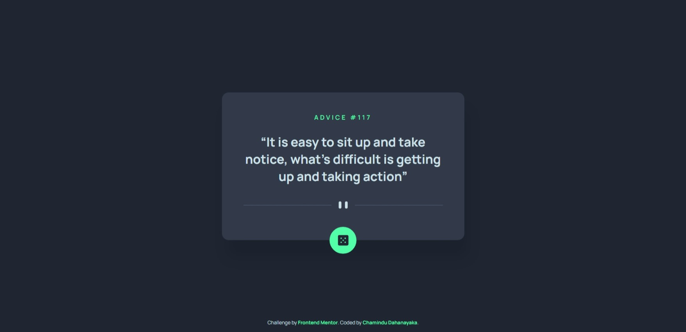

# Frontend Mentor - Advice generator app solution

This is a solution to the [Advice generator app challenge on Frontend Mentor](https://www.frontendmentor.io/challenges/advice-generator-app-QdUG-13db). Frontend Mentor challenges help you improve your coding skills by building realistic projects.

## Table of contents

- [Overview](#overview)
  - [The challenge](#the-challenge)
  - [Screenshot](#screenshot)
  - [Links](#links)
- [My process](#my-process)
  - [Built with](#built-with)
  - [What I learned](#what-i-learned)
  - [Continued development](#continued-development)
- [Author](#author)

## Overview

### The challenge

Users should be able to:

- View the optimal layout for the app depending on their device's screen size
- See hover states for all interactive elements on the page
- Generate a new piece of advice by clicking the dice icon

### Screenshot



### Links

- Solution URL: [Solution URL here](https://your-solution-url.com)
- Live Site URL: [Live site URL here](https://your-live-site-url.com)

## My process

### Built with

- Semantic HTML5 markup
- Flexbox
- Mobile-first workflow
- [Advice Slip API](https://api.adviceslip.com)

### What I learned

In this project, I learned to use below code snippets:

```html
<picture>
  <source media="(max-width: 600px)" srcset="images/pattern-divider-mobile.svg">
  <source media="(min-width: 601px)" srcset="images/pattern-divider-desktop.svg">
  
</picture>
```
```js
async function getQuote(){
  try{
    const response = await fetch(apiURL);

    if(!response.ok){
      throw new Error("Could not fetch resource");
    }

    const data = await response.json();

    number.innerHTML = data.slip.id;
    quote.innerHTML = data.slip.advice;
  }
  catch(error){
    console.error(error);
  }
}
```

### Continued development

I'm looking to improve my CSS & JavaScript knowledge to design more unique and new stuff.

## Author

- Frontend Mentor - [@ChaminduD](https://www.frontendmentor.io/profile/ChaminduD)
- LinkedIn - [Chamindu Dahanayaka](https://www.linkedin.com/in/chamindudahanayaka/)